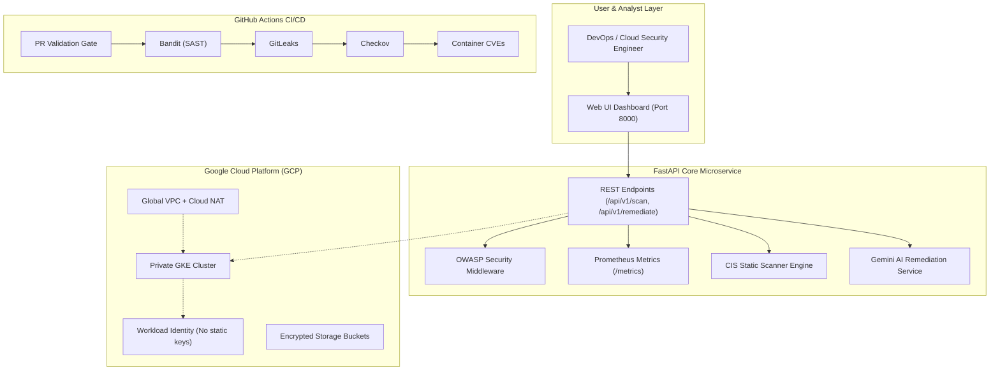

# 📖 CloudSentinel AI: Master Project Guide & Interview Manual

Welcome to **CloudSentinel AI**! This document is your comprehensive, all-in-one guide to understanding every concept, file, architecture decision, and enterprise workflow in this project.

Whether you are studying for **Cloud Engineering, DevOps, Cloud Security, or SRE roles**, this guide walks you through the entire project from first principles and prepares you for technical interviews.

---

## 📑 Table of Contents
1. [Executive Summary: What is this project?](#1-executive-summary)
2. [The Big Picture: How Real IT Companies Build Software](#2-the-big-picture)
3. [Architecture & System Flow](#3-architecture--system-flow)
4. [Tour of the Codebase: Folder-by-Folder Breakdown](#4-tour-of-the-codebase)
5. [The AWS to GCP Translation Guide](#5-the-aws-to-gcp-translation-guide)
6. [Multi-Environment Strategy (Dev vs. Staging vs. Prod)](#6-multi-environment-strategy)
7. [The 8-Stage DevSecOps CI/CD Pipeline](#7-the-8-stage-devsecops-cicd-pipeline)
8. [How AI Overpowers this Platform](#8-how-ai-overpowers-this-platform)
9. [How to Demo This Project (Live Commands)](#9-how-to-demo-this-project)
10. [Interview Preparation: Top Questions & Answers](#10-interview-preparation)

---

## 1. Executive Summary
**CloudSentinel AI** is an enterprise-grade cloud security and observability platform designed to solve one of the biggest challenges in modern DevOps: **Shift-Left Security and Automated Remediation**.

### The Problem it Solves:
In traditional cloud development, developers accidentally commit insecure Dockerfiles (running as root), vulnerable Kubernetes YAMLs (privileged containers), or leaky Terraform scripts (0.0.0.0/0 open security groups). Security teams usually catch these weeks later in production, creating emergency fire drills.

### The CloudSentinel AI Solution:
1. **Static Analysis**: Instantly evaluates IaC configurations against **CIS Benchmarks** and **OWASP** standards.
2. **AI Autonomous Remediation**: Uses **Google Gemini AI** to explain the real-world attack scenario, calculate risk scores, and generate exact unified diff patches.
3. **Automated CI/CD Gating**: Blocks vulnerable code from entering `develop` or `main` branches via GitHub Actions.
4. **SRE Incident Response**: Diagnoses Kubernetes crashes (like `CrashLoopBackOff` or `OOMKilled`) in real-time and produces automated post-mortem runbooks.

---

## 2. The Big Picture: How Real IT Companies Build Software
In a real enterprise environment, software engineering is not a one-person job. It involves multiple specialized teams working in a synchronized cadence:

```
[Software Engineers]  ──> Feature Code & Unit Tests (>80% coverage)
         │
         ▼
[DevSecOps Engineers] ──> Shift-Left Security (SAST, Secrets, Trivy, Checkov)
         │
         ▼
[QA / SDET Engineers] ──> Integration & Smoke Testing against Staging
         │
         ▼
[SRE / Platform Team] ──> Terraform Cloud IaC, Kubernetes GitOps, Prometheus Monitoring
```

### The Promotion Path:
- **Local Machine**: Developer uses Docker Compose with hot reload to build features.
- **Development (Dev)**: Single-pod lightweight environment deployed when a PR merges to `develop`.
- **Staging (UAT)**: Exact production replica with sanitized data where QA and Security perform soak testing.
- **Production (Prod)**: Multi-AZ high availability with strict Zero-Trust NetworkPolicies and automated canary/rolling updates.

---

## 3. Architecture & System Flow



---

## 4. Tour of the Codebase: Folder-by-Folder Breakdown

### 📁 `app/` (Software Development Layer)
- **`app/main.py`**: The central application entrypoint. Configures FastAPI, mounts the Cyber Dashboard, applies OWASP security headers, and exposes `/metrics` for Prometheus.
- **`app/api/routes.py`**: API endpoints:
  - `GET /healthz`: Kubernetes liveness probe.
  - `GET /ready`: Kubernetes readiness probe.
  - `POST /api/v1/scan/iac`: Executes static analysis on Docker, K8s, or Terraform code.
  - `POST /api/v1/remediate/ai`: Calls the Gemini AI engine to generate code patches and threat scenarios.
  - `GET /api/v1/samples/{type}`: Preloaded real-world vulnerable samples for testing.
- **`app/core/config.py`**: Multi-environment configuration powered by Pydantic V2 (`dev`, `staging`, `prod`).
- **`app/core/security.py`**: Middleware adding security headers (`X-Frame-Options`, `CSP`, `HSTS`) and Prometheus metrics measuring HTTP request counts and durations.
- **`app/services/scanner_engine.py`**: Custom-built static security analyzer enforcing CIS Benchmarks (CIS Docker 4.1/4.6, CIS K8s 5.2, CIS GCP 3.6/5.1).
- **`app/services/gemini_service.py`**: Google Gemini API integration with intelligent heuristic fallback when no API key is supplied.
- **`app/static/`**: Cyber-themed, responsive web dashboard built with HTML5, modern CSS, and vanilla JS.

### 📁 `docker/` (Containerization Layer)
- **`docker/Dockerfile`**: Production-grade multi-stage Docker build.
  - Stage 1 (`builder`): Compiles dependencies.
  - Stage 2 (`runtime`): Uses `python:3.12-slim`, creates non-privileged user `appuser` (UID 10001), switches to `USER 10001`, and sets a container `HEALTHCHECK`.
- **`docker/Dockerfile.dev`**: Fast-boot container with volume-mounted live code reload.
- **`docker/docker-compose.yml`**: Multi-service stack linking the application to a dedicated Prometheus container.

### 📁 `k8s/` (Kubernetes Layer with Kustomize)
- **`k8s/base/`**: Universal production templates:
  - `deployment.yaml`: CIS-hardened pod specification with `readOnlyRootFilesystem: true`, `runAsNonRoot: true`, `allowPrivilegeEscalation: false`, and dropped capabilities.
  - `networkpolicy.yaml`: Zero-trust network policy (default deny all ingress/egress, allow only approved ports).
  - `hpa.yaml`: Horizontal Pod Autoscaler scaling from 2 to 10 replicas.
  - `service.yaml` & `configmap.yaml`.
- **`k8s/overlays/dev/`**: Overrides base for 1 replica, lightweight resources, and debug logging.
- **`k8s/overlays/staging/`**: Staging overlay with 2 replicas and staging environment secrets.
- **`k8s/overlays/prod/`**: Production overlay with 3+ replicas, multi-zone anti-affinity, and SSL/TLS Ingress.

### 📁 `terraform/` (Infrastructure as Code Layer)
- **`terraform/modules/vpc/`**: Google Cloud Global Custom VPC, Cloud Router, Cloud NAT, and VPC firewall rules.
- **`terraform/modules/gke/`**: Production Private GKE Cluster with Workload Identity, Shielded nodes, and Network Policy.
- **`terraform/modules/iam/`**: Least-privilege IAM service accounts and Workload Identity bindings (linking Kubernetes Service Accounts directly to GCP Service Accounts without JSON keys).
- **`terraform/modules/gcs/`**: CIS GCP-compliant Google Cloud Storage bucket with uniform bucket-level access and public access prevention.
- **`terraform/environments/`**: Dedicated environment roots (`dev/`, `staging/`, `prod/`) with environment-specific `terraform.tfvars`.

### 📁 `.github/` (DevSecOps CI/CD Layer)
- **`CODEOWNERS`**: Restricts who can approve pull requests depending on the subsystem.
- **`workflows/pr-validation.yml`**: Pull Request gate executing Unit Tests, Bandit SAST, GitLeaks secret detection, Checkov IaC scanning, and Trivy container vulnerability scanning.
- **`workflows/deploy-dev.yml`**: Automatically builds and deploys to the Dev GKE cluster on push to `develop`.
- **`workflows/deploy-prod.yml`**: Production release pipeline with gated environment approval and SBOM (Software Bill of Materials) generation via Syft.

### 📁 `observability/` & `scripts/` (SRE Layer)
- **`observability/prometheus.yml` & `alerts.yml`**: Golden signals monitoring (HTTP requests, latency, 5xx errors, security finding rates).
- **`scripts/ai_incident_responder.py`**: Automated AIOps triage script simulating an on-call engineer diagnosing `CrashLoopBackOff` or `OOMKilled` incidents using AI.
- **`scripts/start_dev.ps1`**: 1-click Windows PowerShell dev launcher.

---

## 5. The AWS to GCP Translation Guide
Since you have AWS experience, here is how the concepts translate directly into GCP:

| AWS Concept | GCP Equivalent in CloudSentinel | Key Difference |
| :--- | :--- | :--- |
| **AWS Account** | **GCP Project** | Resources are scoped to Projects; Projects sit under Folders and an Organization. |
| **Regional VPC** | **Global VPC** | GCP VPCs are global; subnets in different regions communicate privately without peering! |
| **NAT Gateway** | **Cloud NAT** | Software-defined, fully managed distributed NAT without dedicated gateway instances. |
| **Security Groups** | **VPC Firewall Rules** | Applied per network using target tags (`cloudsentinel-node`) or service accounts. |
| **IRSA** | **Workload Identity** | Binds Kubernetes Service Accounts (KSA) to Google Service Accounts (GSA) without static JSON credentials. |
| **Amazon EKS** | **Google Kubernetes Engine (GKE)** | GKE is deeply integrated into Google Cloud with native Workload Identity and Private clusters. |
| **Amazon ECR** | **Artifact Registry** | Universal package and container repository (`<region>-docker.pkg.dev/...`). |

*(For full details, see [`docs/GCP_VS_AWS_GUIDE.md`](file:///E:/CloudSentinel-AI/docs/GCP_VS_AWS_GUIDE.md))*

---

## 6. Multi-Environment Strategy
In CloudSentinel AI, environment separation is enforced at every layer:

1. **At the Application Layer**:
   - `ENVIRONMENT=dev|staging|prod` changes log levels and CORS policies.
2. **At the Kubernetes Layer (Kustomize)**:
   - Dev runs 1 replica with burstable CPU.
   - Staging runs 2 replicas with pre-prod secrets.
   - Prod runs 3+ replicas with HPA, PodAntiAffinity, and TLS ingress.
3. **At the Terraform Layer**:
   - Separate state and variables in `terraform/environments/{dev,staging,prod}` preventing changes in dev from accidentally touching production infrastructure.

---

## 7. The 8-Stage DevSecOps CI/CD Pipeline
Whenever a developer opens a Pull Request to `develop` or `main`:

```text
1. [Checkout & Setup]     ──> Clones code, installs Python 3.12
2. [Unit & Integration]   ──> Runs Pytest with strict >80% coverage gate
3. [SAST Security Scan]   ──> Bandit scans Python code for OWASP flaws
4. [Secret Leak Detection]──> GitLeaks inspects commit history for exposed keys
5. [IaC Security Audit]   ──> Checkov scans Terraform, K8s, and Dockerfiles
6. [Container CVE Scan]   ──> Trivy audits container layers for OS/package CVEs
7. [Artifact Build]       ──> Builds container and generates SBOM (Syft)
8. [GitOps Deployment]    ──> Applies Kustomize overlay to target GKE cluster
```

---

## 8. How AI Overpowers this Platform
Unlike traditional static scanners that only output cryptic error messages like `CIS-K8S-5.2.1 FAILED`, CloudSentinel AI:

1. **Simulates the Threat Vector**: Explains step-by-step how a threat actor would exploit the vulnerability.
2. **Generates the Exact Code Patch**: Produces a unified diff (`--- original +++ remediated`) that can be copy-pasted or applied automatically.
3. **Drafts SRE Incident Post-Mortems**: Ingests container crash logs or Prometheus alerts and generates instant root-cause analysis (RCA) and runbook remediation steps.

---

## 9. How to Demo This Project (Live Commands)

### 1. Launch the Application Server:
```powershell
Set-Location "E:\CloudSentinel-AI"
.\scripts\start_dev.ps1
```
- Open **Web Dashboard**: `http://127.0.0.1:8000`
- Open **Swagger Docs**: `http://127.0.0.1:8000/docs`
- Open **Prometheus Metrics**: `http://127.0.0.1:8000/metrics`

### 2. Run the Automated Test Suite:
```powershell
.\.venv\Scripts\pytest.exe tests/ -v
```

### 3. Run the AI Incident Responder:
```powershell
# Simulate an IAM authorization crash in staging:
.\.venv\Scripts\python.exe .\scripts\ai_incident_responder.py crashloop

# Simulate an Out-Of-Memory container termination:
.\.venv\Scripts\python.exe .\scripts\ai_incident_responder.py oom
```

---

## 10. Interview Preparation: Top Questions & Answers

### Q1: "Can you tell me about a project you've worked on recently?"
> **Answer**:  
> *"I built **CloudSentinel AI**, an enterprise-grade cloud security and DevSecOps platform. It addresses the Shift-Left security challenge by statically analyzing Dockerfiles, Kubernetes manifests, and Google Cloud Terraform scripts against CIS Benchmarks. To take it further, I integrated Google Gemini AI to autonomously map out the attack vector and generate ready-to-apply unified diff patches. The project features production-grade Kubernetes manifests managed with Kustomize across Dev, Staging, and Prod, an 8-stage GitHub Actions DevSecOps pipeline with SAST and container vulnerability scanning, and Prometheus observability with automated SRE incident post-mortem generation."*

### Q2: "How do you handle multi-environment configurations in Kubernetes?"
> **Answer**:  
> *"I use **Kustomize** with a `base` and `overlays` pattern. The `base/` directory defines the core production templates—including CIS-compliant securityContexts, zero-trust NetworkPolicies, and probe definitions. Then, `overlays/dev/`, `staging/`, and `prod/` apply environment-specific patches—such as replica counts (1 in Dev vs. 3+ with HPA in Prod), resource limits, ingress domain names, and environment variables. This avoids template duplication and keeps configuration DRY."*

### Q3: "How does Workload Identity work in GCP, and why is it better than service account keys?"
> **Answer**:  
> *"In traditional setups, applications authenticate to GCP using downloaded JSON service account keys, which are prone to leaks and require manual rotation. GCP **Workload Identity** binds a Kubernetes Service Account directly to a Google Cloud Service Account using Google's metadata server. The pod automatically receives short-lived, rotated OAuth tokens. In CloudSentinel, our Terraform IAM module declares this binding declaratively, completely eliminating static credentials from the cluster."*

### Q4: "What security checks did you build into your CI/CD pipeline?"
> **Answer**:  
> *"In `.github/workflows/pr-validation.yml`, we enforce an 8-stage gate before any code can merge to `develop` or `main`:  
> 1. **Unit tests with Pytest** (enforcing a >80% coverage threshold).  
> 2. **Bandit** for SAST scanning of Python code for OWASP Top 10 flaws.  
> 3. **GitLeaks** to prevent accidental credential leakage in git history.  
> 4. **Checkov** to audit Terraform and Kubernetes manifests for CIS benchmark violations.  
> 5. **Trivy** to scan built container layers for OS and package CVEs.  
> 6. In the production pipeline, we also generate a **Software Bill of Materials (SBOM)** with Syft for supply-chain security."*
